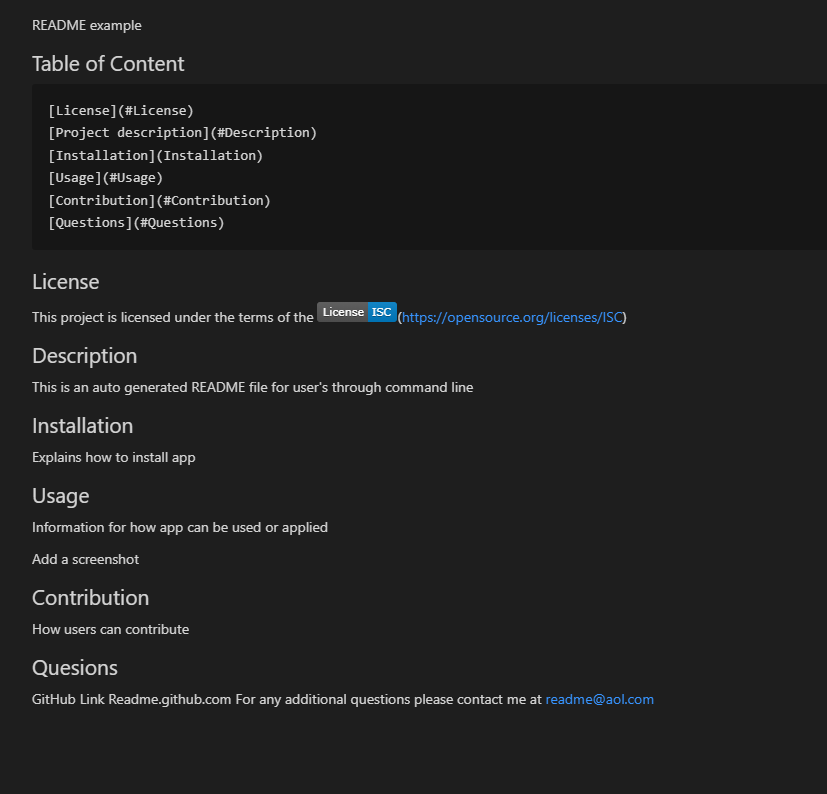
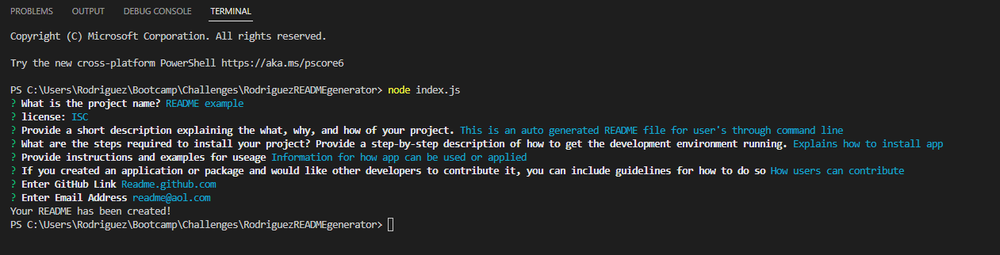

# README Generator
This open source procject on Github, creates a high-quality README for any application. This allows the project creator to devote more time to working on the project. The README will include Project name, description, how to install, instructions for useage, contribution, and contact links. 

# Github Link
https://github.com/Rodash4/RodriguezREADMEgenerator

# The following image shows the web application's appearance and functionality:

# Video

[]

Video Link: https://drive.google.com/file/d/1EunEk2086uQ3he_7zyiUQ84EFm6ZCkyP/view

git 
